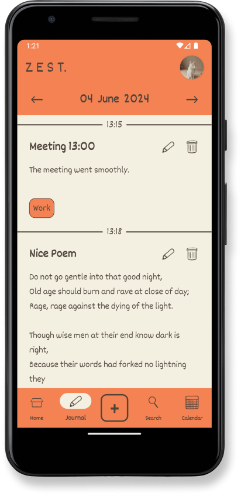

# Zest

## Design

  
  
  

## Features

- Creating a user profile
- Upload profile picture
- Create and manage journal entries
- Add tags to your entries
- Track your journaling in a Calendar

## Technical Structure

#### Project Structure
The project is built following the MVVM architecture. Repositories with the Repository Pattern, Models, Views and Viewmodels.

#### Data Storage
Firebase will be used for data storage.

#### API Call
https://zenquotes.io/api/

#### 3rd-Party Frameworks

- Firebase iOS SDK
- FirebaseAuth
- FirebaseFirestore
- FirebaseStorage

## Credit

- Designer & Artist - Tuile (https://tuile.itch.io/)
- Developer - Juuuriii(Juri Huhn)